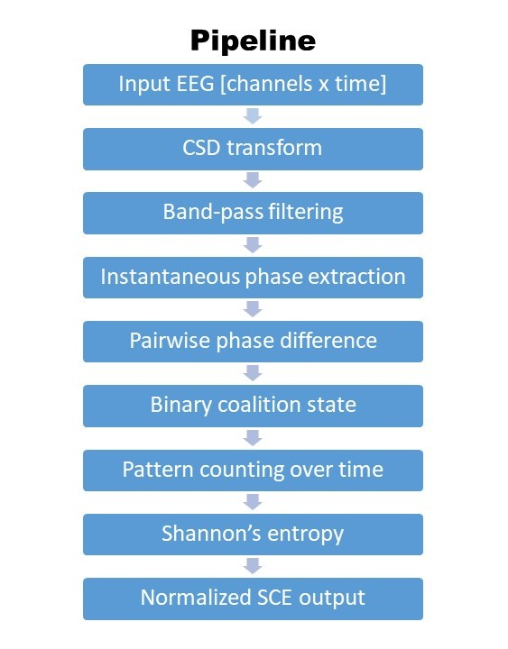

# EEG-Metastability


MATLAB code for calculating EEG-derived metastability-related measures, including channel-wise **Synchrony Coalition Entropy (SCE)** and **Metastability index (MSI)**, from preprocessed continuous EEG recordings.

This repository is intended for researchers who want to quantify frequency-specific phase-synchrony dynamics in EEG data using a relatively simple and transparent pipeline.
<div align="left">
  
</div>


## Overview

This pipeline performs the following steps for each subject and frequency bin:

1. Load preprocessed EEG data from `.mat` files
2. Optionally apply **Current Source Density (CSD)** transformation
3. Compute complex wavelet coefficients using `izmy_gbweeg.m`
4. Extract instantaneous phase
5. Build binary synchrony coalitions using a phase-difference threshold
6. Compute **channel-wise Synchrony Coalition Entropy (SCE)**
7. Save per-subject and per-frequency results

---

## Features

- Frequency-resolved analysis
- Channel-wise SCE output
- Optional CSD preprocessing
- Batch processing of multiple subjects
- Parallel processing support (`parfor`)
- Structured output suitable for downstream statistics

---

## Requirements

### MATLAB
Tested in MATLAB with standard numeric and parallel computing functionality.

### Required external dependencies
This repository does **not** bundle all third-party dependencies. You need:

- **EEGLAB**  
  Required for `eegfilt`

- **CSD toolbox / CSDconvert function**  
  Required only if `UseCSD = true`

- **CSD basis file**  
  Example parameter: `CSDbasis.mat`

### Included in this repository
- `calcMSISCE.m`
- `izmy_gbweeg.m`

---

## Input data format

Each input file must be a `.mat` file containing an EEG structure:

```matlab
EEG.data
```

with shape:
```matlab
[channels x timepoints]
```

## Default assumptions

- Files are named like `sub_001.mat`, `sub_002.mat`, etc.
- Data are already preprocessed
- Noise/artifact rejection has already been completed
- Data are continuous, not epoched
- Default number of channel is 63
- Default sampling rate is 1000 Hz
If you dataset uses different names or formats, you can change them via function arguments.

---

# Quick start
```matlab
results = calcMSISCE('./data', ...
    'OutputDir', './results', ...
    'SaveResults', true, ...
    'UseCSD', true, ...
    'CSDBasisFile', './CSDbasis.mat');
```

### Example dataset

A small toy dataset is provided for demonstration purposes.

### Files

- `example_data/sub_001.mat`  
- `examples/make_example_dataset.m`
- `examples/run_example.m`

The example dataset contains a MATLAB structure:

# Main function
```matlab
results = calcMSISCE(inputDir, Name, Value, ...)
```

## Important parameters

| Parameter | Description | Default |
|---|---|---:|
| `FilePattern` | Input filename pattern | `'sub_*.mat'` |
| `OutputDir` | Output directory for saved results | `''` |
| `SaveResults` | Save results to disk | `false` |
| `OutputFileName` | Output `.mat` filename | `'msi_sce_results.mat'` |
| `DataVariable` | Variable name inside `.mat` file | `'EEG'` |
| `DataField` | Field name containing the signal | `'data'` |
| `SampleRate` | Sampling rate in Hz | `1000` |
| `Channels` | Number of channels to use | `63` |
| `TimeIndices` | Time samples to analyze | `[]` (all samples) |
| `FrequencyRange` | Center frequencies to analyze | `1:47` |
| `BandWidth` | Band-pass width in Hz | `1` |
| `Threshold` | Phase-difference threshold (radians) | `1.2` |
| `UseCSD` | Apply CSD transform | `true` |
| `CSDBasisFile` | Path to CSD basis file | `'CSDbasis.mat'` |
| `WaveletCycles` | Wavelet cycle parameter passed to `izmy_gbweeg` | `1` |
| `UseParallel` | Use `parfor` if available | `true` |
| `Verbose` | Print progress messages | `true` |

---

## Output

The function returns a struct named `results` with the following fields.

| Field | Description |
|---|---|
| `subjectIds` | Subject IDs extracted from filenames |
| `fileNames` | Processed filenames |
| `frequencies` | Frequency bins analyzed |
| `threshold` | Phase threshold used for coalition binarization |
| `sampleRate` | Sampling rate |
| `channels` | Number of analyzed channels |
| `timeIndices` | Time samples used |
| `nSCE` | Channel-wise normalized SCE, shape `[subjects x channels x frequencies]` |
| `meanSCE` | Mean SCE across channels, shape `[subjects x 1 x frequencies]` |
| `phaseDispersion` | Phase-dispersion summary, shape `[subjects x 1 x frequencies]` |
| `patternValues` | Unique coalition patterns for each subject/frequency/channel |
| `patternCounts` | Counts for each coalition pattern |
| `metadata` | Analysis settings and provenance information |

---

## Method summary

### 1. Filtering
For each frequency bin, the signal is band-pass filtered using `eegfilt`.

### 2. CSD transform
If enabled, Current Source Density transformation is applied to reduce volume conduction effects and emphasize local activity.

### 3. Wavelet transform
`izmy_gbweeg.m` computes complex wavelet coefficients for each channel.

### 4. Phase extraction
Instantaneous phase is extracted from the complex-valued wavelet output.

### 5. Synchrony coalition
For each channel and time point, all pairwise phase differences are thresholded:

- synchronized = `1` if `abs(phase difference) < threshold`
- unsynchronized = `0` otherwise

### 6. Entropy calculation
For each channel, the time series of binary coalition states is converted into discrete patterns.  
The probability distribution of these coalition states is used to compute Shannon entropy in bits, then normalized.

---

## Example workflow

```matlab
results = calcMSISCE('./data', ...
    'FilePattern', 'sub_*.mat', ...
    'SampleRate', 1000, ...
    'Channels', 63, ...
    'FrequencyRange', 1:47, ...
    'Threshold', 1.2, ...
    'UseCSD', true, ...
    'CSDBasisFile', './CSDbasis.mat', ...
    'SaveResults', true, ...
    'OutputDir', './results');
```

To inspect the average SCE spectrum across subjects:
```matlab
groupMean = squeeze(mean(results.meanSCE, 1, 'omitnan'));
plot(results.frequencies, groupMean, 'LineWidth', 2);
xlabel('Frequency (Hz)');
ylabel('Mean normalized SCE');
title('Group-average SCE spectrum');
```

---

# Notes and limitations
- This code assumes continuous EEG with shape `[channels x timepoints]`.
- Input preprocessing must be done before running this pipeline.
- The current implementation stores coalition patterns using `uint64`, so very high channel counts may require modification.
- If your data structure differs from `EEG.data`, set `DataVariable` and `DataField` accordingly.
- The exact interpretation of the phase-dispersion summary may depend on your analysis design; adapt downstream statistical analysis as needed.

---

# Recommended repository structure
```
EEG-Metastability/
├── calcMSISCE.m
├── izmy_gbweeg.m
├── README.md
├── CSDbasis.mat              % not tracked if license/distribution is restricted
├── examples/
│   └── run_example.m
└── data/
    └── sub_001.mat           % user-provided, not included in repo
```
---
# Citation
If you use this code in academic work, please cite:
1. This repository
2. Shanahan
3. EEGLAB
4. Any CSD toolbox or basis file source you use
You may also want to add a `CITATION.cff` file to this repository.

---

# License
Please add an explicit open-source license before broad public reuse.
Recommended options:
- `MIT` for maximum reuse
- `BSD-3-Clause` for permissive academic/software reuse
Without a license, others may be unable to legally reuse the code.

---

## Contact
Maintainer: Mebuki Izumiya mebuki@nips.ac.jp

If you publish work using this repository, a GitHub issue or citation is appreciated.
