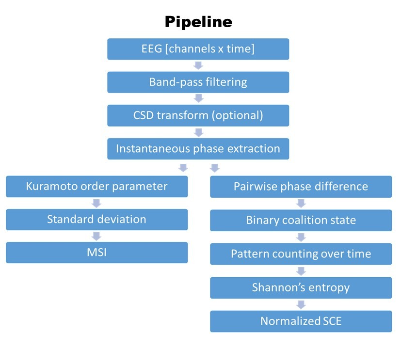

# EEG-Metastability


MATLAB code for calculating EEG metastability-related measures, including channel-wise **Synchrony Coalition Entropy (SCE)** and **Metastability index (MSI)**, from preprocessed continuous EEG recordings.

This repository is intended for researchers who want to quantify frequency-specific phase-synchrony dynamics in EEG data using a relatively simple and transparent pipeline.
<div align="left">
  
</div>


## Overview

This pipeline performs the following steps for each subject and frequency bin:

1. Load preprocessed EEG data from `.mat` files
2. Compute complex wavelet coefficients using `izmy_gbweeg.m`
3. Extract instantaneous phase
4. Compute **channel-wide Metastability index (MSI)**
5. Build binary synchrony coalitions using a phase-difference threshold
6. Compute **channel-wise Synchrony Coalition Entropy (SCE)**
7. Save per-subject and per-frequency results

---

## Features

- Frequency-resolved analysis
- Channel-wide MSI output
- Channel-wise SCE output
- Batch processing of multiple subjects
- Parallel processing support (`parfor`)

---

## Requirements

### MATLAB
Tested in MATLAB with standard numeric and parallel computing functionality.

### Required external dependencies
This repository does **not** bundle all third-party dependencies. You need:

- **EEGLAB**  
  Required for `eegfilt`

### Included in this repository
- `calcMSISCE.m`
- `izmy_gbweeg.m`

---

## Input data format

Each input file must be a `.mat` file containing an EEG structure:

```matlab
EEG.data
```

with shape:
```matlab
[channels x timepoints]
```

The input data should be continuous EEG.
As a preprocessing, we recommend applying Current source density (CSD) by external toolbox and it was not included this repository.

## Default assumptions

- Files are named like `sub_001.mat` etc.
- Data are already preprocessed
- Noise/artifact rejection has already been completed
- Data are continuous, not epoched
- Default number of channel is 63
- Default sampling rate is 1000 Hz

If you dataset uses different names or formats, you can change them via function arguments.

---

# Quick start
```matlab
results = calcMSISCE('./data', ...
    'OutputDir', './results', ...
    'SaveResults', true);
```

### Example dataset

A small toy dataset is provided for demonstration purposes.

### Files

The example dataset contains a MATLAB structure:
- `example_data/sub_001.mat`  
- `examples/make_example_dataset.m`
- `examples/run_example.m`


# Main function
```matlab
results = calcMSISCE(inputDir, Name, Value, ...)
```

## Important parameters

| Parameter | Description | Default |
|---|---|---:|
| `FilePattern` | Input filename pattern | `'sub_*.mat'` |
| `OutputDir` | Output directory for saved results | `''` |
| `SaveResults` | Save results to disk | `false` |
| `OutputFileName` | Output `.mat` filename | `'msi_sce_results.mat'` |
| `DataVariable` | Variable name inside `.mat` file | `'EEG'` |
| `DataField` | Field name containing the signal | `'data'` |
| `SampleRate` | Sampling rate in Hz | `1000` |
| `Channels` | Number of channels to use | `63` |
| `TimeIndices` | Time samples to analyze | `[]` (all samples) |
| `FrequencyRange` | Center frequencies to analyze | `1:47` |
| `BandWidth` | Band-pass width in Hz | `1` |
| `Threshold` | Phase-difference threshold (radians) | `1.2` |
| `WaveletCycles` | Wavelet cycle parameter passed to `izmy_gbweeg` | `1` |
| `UseParallel` | Use `parfor` if available | `true` |
| `Verbose` | Print progress messages | `true` |

---

## Output

The function returns a struct named `results` with the following fields.

| Field | Description |
|---|---|
| `subjectIds` | Subject IDs extracted from filenames |
| `fileNames` | Processed filenames |
| `frequencies` | Frequency bins analyzed |
| `threshold` | Phase threshold used for coalition binarization |
| `sampleRate` | Sampling rate |
| `channels` | Number of analyzed channels |
| `timeIndices` | Time samples used |
| `nSCE` | Channel-wise normalized SCE, shape `[subjects x channels x frequencies]` |
| `meanSCE` | Mean SCE across channels, shape `[subjects x 1 x frequencies]` |
| `patternValues` | Unique coalition patterns for each subject/frequency/channel |
| `patternCounts` | Counts for each coalition pattern |
| `metadata` | Analysis settings and provenance information |

---

## Method summary

### 1. Filtering
For each frequency bin, the signal is band-pass filtered using `eegfilt`.

### 2. Wavelet transformation
`izmy_gbweeg.m` computes complex wavelet coefficients for each channel.

### 3. Phase extraction
Instantaneous phase is extracted from the complex-valued wavelet output.

### 4. MSI calculation
At each time point, a network-wide phase synchrony value is computed across channels.  
MSI is defined as the temporal variability (variance) of this synchrony over time.

### 5. SCE calculation 
For SCE calculation, synchrony coalition was made which is all pairwise phase differences are thresholded for each channel and time point:

- synchronized = `1` if `abs(phase difference) < threshold`
- unsynchronized = `0` otherwise

For each channel, the time series of binary coalition states is converted into discrete patterns.  
The probability distribution of these coalition states is used to compute Shannon entropy in bits, then normalized.

---

## Example workflow

```matlab
results = calcMSISCE('./data', ...
    'FilePattern', 'sub_*.mat', ...
    'SampleRate', 1000, ...
    'Channels', 63, ...
    'FrequencyRange', 1:47, ...
    'Threshold', 1.2, ...
    'SaveResults', true, ...
    'OutputDir', './results');
```

To inspect the average SCE spectrum across subjects:
```matlab
groupMean = squeeze(mean(results.meanSCE, 1, 'omitnan'));
plot(results.frequencies, groupMean, 'LineWidth', 2);
xlabel('Frequency (Hz)');
ylabel('Mean normalized SCE');
title('Group-average SCE spectrum');
```

---

# Notes and limitations
- This code assumes continuous EEG with shape `[channels x timepoints]`.
- Input preprocessing must be done before running this pipeline.
- The current implementation stores coalition patterns using `uint64`, so very high channel counts may require modification.
- If your data structure differs from `EEG.data`, set `DataVariable` and `DataField` accordingly.
- The exact interpretation of the phase-dispersion summary may depend on your analysis design; adapt downstream statistical analysis as needed.

---

# Recommended repository structure
```
EEG-Metastability/
├── calcMSISCE.m
├── izmy_gbweeg.m
├── README.md
├── examples/
    └── run_example.m
    └── make_example_eeg.m    % make dummy eeg data
└── data/
    └── sub_001.mat           % user-provided, not included in repo
```
---

# Citation
If you use this code in academic work, please cite:
1. This repository (https://github.com/i-meb/EEG-Metastability)
2. Shanahan M. Metastable chimera states in community-structured oscillator networks. Chaos. 2010;20(1):013108.
3. Delorme A & Makeig S (2004) EEGLAB: an open-source toolbox for analysis of single-trial EEG dynamics, Journal of Neuroscience Methods 134:9-21.

Please cite this repository using the metadata provided in [`CITATION.cff`](./CITATION.cff).

---

# License
This project is released under the **BSD 3-Clause License**.
This is a permissive open-source license that allows redistribution and use in both source and binary forms, with or without modification.

- The original copyright notice and license must be retained  
- Proper attribution to the original author must be maintained  
- The names of the authors or affiliated institutions must not be used to endorse or promote derived products without prior permission  
- The authors are not liable for any damages arising from the use of this software.
- If you use this code in academic work, please consider citing the repository and relevant publications.

---

## Contact
Maintainer: Mebuki Izumiya mebuki@nips.ac.jp

            Division of Neural Dynamics
            National Institute for Physiological Sciences, National Institutes of Natural Sciences
            38 Nishigonaka, Myodaiji, Okazaki, Aichi 444-8585, JAPAN
            Tel: +81-564-55-7751, FAX: +81-564-55-7754

